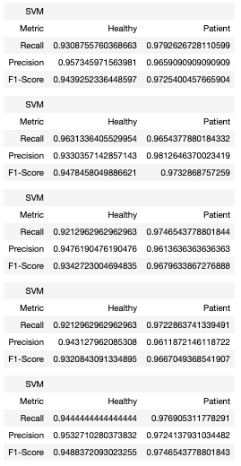
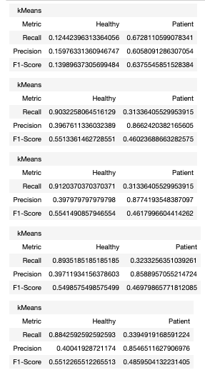

# Cross Validation for Pathological Dataset 2

## Dataset

Number of Healthy Samples: 1082   
Number of Patient Samples: 2168   
Total Samples: 3250   

## Results

Five fold cross validation: 

1. SVM Model   

2. k-Means Clustering   

3. Random Forest Classifier   

